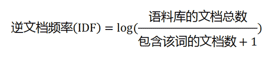

## TF-IDF

TF指Term frequecy,代表词频,IDF代表inverse document frequency,叫做逆文档频率。
<!--more-->
这个算法可以用来提取文档的关键词，首先一般认为在文章中出现次数较多的词是关键词，词频就代表了这一项，结果你肯定猜到了，出现次数最多的词是----"的"、"是"、"在"----这一类最常用的词。它们叫做"停用词"（stop words），表示对找到结果毫无帮助、必须过滤掉的词。比如过滤之后再统计词频出现了中国，蜜蜂，养殖且三个词的词频几乎一致，但是"中国"是很常见的词，相对而言，"蜜蜂"和"养殖"不那么常见。
所以，我们需要一个重要性调整系数，衡量一个词是不是常见词。如果某个词比较少见，但是它在这篇文章中多次出现，那么它很可能就反映了这篇文章的特性，正是我们所需要的关键词。
显然，“中国”这个词出现在其他文章的概率比其他两个词要高不少，因此我们应该认为后两个词更能表现文章的主题，用统计学语言表达，就是在词频的基础上，要对每个词分配一个"重要性"权重。最常见的词（"的"、"是"、"在"）给予最小的权重，较常见的词（"中国"）给予较小的权重，较少见的词（"蜜蜂"、"养殖"）给予较大的权重。这个权重叫做"逆文档频率"（Inverse Document Frequency，缩写为IDF），它的大小与一个词的常见程度成反比。计算该值需要一个语料库，如果一个词在语料库中出现的概率越小，那么该词的IDF应该越大，一般来说TF计算公式为


考虑到文章有长短之分，为了便于不同文章的比较，进行"词频"标准化。


或者


IDF计算公式为：

这里，需要一个语料库（corpus），用来模拟语言的使用环境。



如果一个词越常见，那么分母就越大，逆文档频率就越小越接近0。分母之所以要加1，是为了避免分母为0（即所有文档都不包含该词）（平滑）。

将两者乘乘起来就得到了词的TF-IDF。


TF-IDF算法的优点是简单快速，结果比较符合实际情况。缺点是，单纯以"词频"衡量一个词的重要性，不够全面，有时重要的词可能出现次数并不多。而且，这种算法无法体现词的位置信息，可以针对不同位置赋予不同的权重进行修正（比如，对全文的第一段和每一段的第一句话，给予较大的权重），注意这些修正之所以是有效的，正是因为人观测过了大量的信息，因此建议了一个先验估计，人将这个先验估计融合到了算法里面，所以使算法更加的有效。

## 余弦距离是什么，有哪些作用？

余弦距离是两个向量的距离的一种度量方式，其值在-1~1之间，如果为1表示两个向量同相，0表示两个向量正交，-1表示两个向量反向。两条线段之间形成一个夹角，如果夹角为0度，意味着方向相同、线段重合；如果夹角为90度，意味着形成直角，方向完全不相似；如果夹角为180度，意味着方向正好相反。因此，我们可以**通过夹角的大小，来判断向量的相似程度。夹角越小，就代表越相似。**

### 余弦计算公式

假定a向量是[x1, y1]，b向量是[x2, y2]，那么可以将余弦定理改写成下面的形式：


数学家已经证明，余弦的这种计算方法对n维向量也成立。假定A和B是两个n维向量，A是 [A1, A2, ..., An] ，B是 [B1, B2, ..., Bn] ，则A与B的夹角θ的余弦等于：


由此，我们就得到了"找出相似文章"的一种算法：

```
　　（1）使用TF-IDF算法，找出两篇文章的关键词；
　　（2）每篇文章各取出若干个关键词（比如20个），合并成一个集合，计算每篇文章对于这个集合中的词的词频（为了避免文章长度的差异，可以使用相对词频）；
　　（3）生成两篇文章各自的词频向量；
　　（4）计算两个向量的余弦相似度，值越大就表示越相似。
```

"余弦相似度"是一种非常有用的算法，只要是计算两个向量的相似程度，都可以采用它。

参考：
1. http://www.ruanyifeng.com/blog/2013/03/tf-idf.html

2. 统计学习方法(李航)