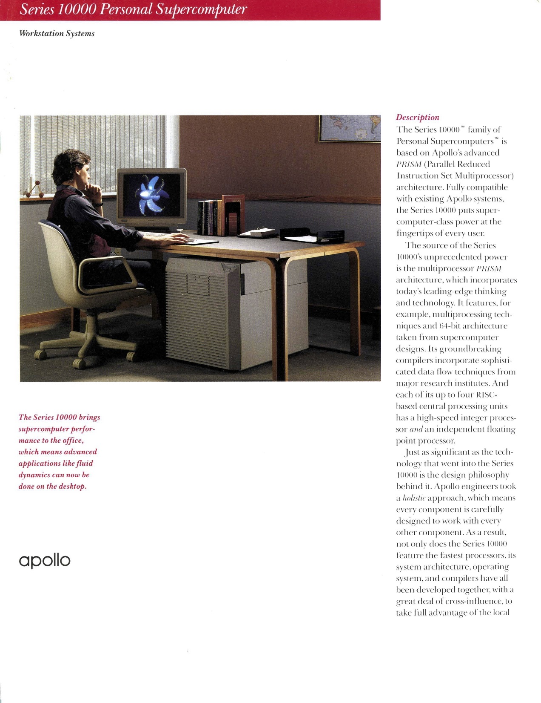
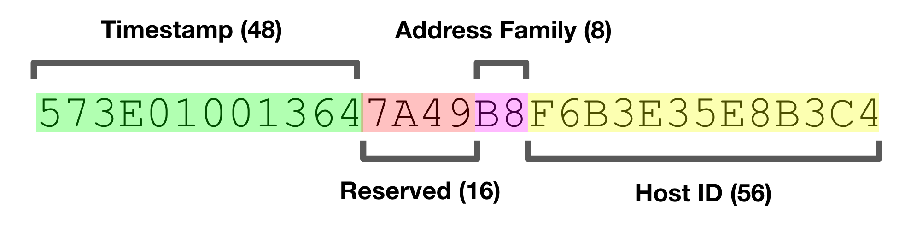
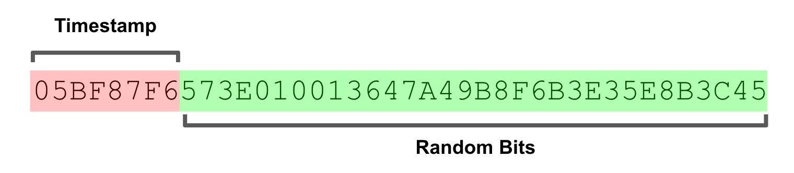
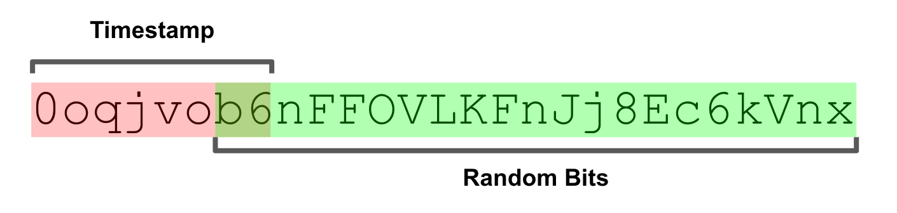

本文最初发布于[Segment官方博客](https://segment.com/blog/)，原作者：[Rick Branson](https://segment.com/blog/authors/rick-branson/)。经授权由[InfoQ中文站](http://www.infoq.com/cn/articles/talk-about-the-history-of-uuid)翻译并分享。阅读英文原文：[A Brief History of the UUID](https://segment.com/blog/a-brief-history-of-the-uuid/)。

今天，我们发布了KSUID，一款用于生成唯一ID的Golang库。该产品借鉴了目前广泛使用的UUID标准一些核心理念，增加了基于时间的排序功能，可提供更友好的表现格式。在针对该产品进行调研的过程中，我们发现UUID的背后其实还有一个极富吸引力的故事，想要借助本文分享给大家。
<!--more-->
自从两台甚至更多计算机可以通过网络交换信息那天起，它们就需要一种能够体现唯一性的“身份”。

第一个符合目前我们所知这种定义的“网络”，是1870年代建立的全球首个电话交换网。在此之前，电话线路完全是一种点对点链路。尽管在当时这有着划时代的意义，但这种网络很昂贵，不灵活，也不可靠。甚至导致各大主要城市街头形成了电线交织而成的“蜘蛛网”。


当时哪怕电报也只能被政府和企业用于传递重要信息，电话就更是一种奢侈品了。考虑到电报的速度，专门架设昂贵的电线来更快速的“聊天”，似乎是一种很夸张的做法。不过随后的一个重要创新：可创建交换电路的电话总机，让电话变得更实用。此时电话才真正深入寻常百姓家。而电话总机也为电话网络引入了首个具备唯一性的身份：电话号码。

几十年后，计算机网络出现了。突然之间，身份的粒度有了数量级的提升。

当时，通过电话线路传输数据是一种短暂执行的操作，网络只起到管道作用。现在，按需存储和获取数据的做法已变得极为普遍，整个世界已淹没在数量爆发式增长的数据海洋中。在这些新能力影响下，网络身份对应的主体已由传统计算机实体变为组成数据的逻辑片段。

这样的网络需要通过某种具备唯一性的方式对数据片段寻址，电话网络时代那种需要集中控制的系统已无法满足需求。从数学的角度来看，这种问题是不可避免的，毕竟网络存储和检索数据的能力以及数据的规模都在线性增长着。这样的规模在一定程度上还产生了些许混乱：各种故障和暂存的计算机也已经从牦牛剪毛（译注：牦牛剪毛，Yak shaving，是指为了间接实现一个目标而做的次要，并且与目标无关的工作）问题变得稀疏平常。数据不再只安于一地，而是会在整个网络内自由移动。

## 计算领域迎来网络化时代

很快到了1980年代，当时使用计算机共享数据实际上意味着要共享整个实体计算机。各大机构会使用微型计算机，以及连接了几百上千台哑终端的高性能大型机交换信息。

换句话说，当时数据本身与计算工作是共存的。虽然个人计算机提供了革命性的计算能力，但由于缺乏网络功能，当时的个人计算机实际上只是一种奢侈的计算器。

成立于1980年的Apollo Computer，曾是步入当时新兴工作站市场的首批公司之一。工作站才是真正意义上的第一种可联网计算机，使用“工作站”这个词描述这种计算机听起来似乎有点滑稽，但别忘了，目前我们习以为常的各种网络技术在当时还处于萌芽状态。与大型机相比，数据和计算功能分散在很多相互连接的计算机中，而此时“分布式计算”这个词也开始进入主流视野。



与同时代的Sun Microsystems类似，Apollo的产品也是全栈的。一切都需要从零开始来开发，因为当时软硬件在设计方面与他们构想的用例还有些差异。网络的异步性以及这些任务的本质需求需要功能更丰富的计算机。多任务、安全控制、网络，以及海量存储等特征对当时的个人计算机来说要么过于昂贵，要么不够现实。不过在工作站的未来构想中，这些特征已成为了“标配”。

尽管工作站市场上的各类技术经历了让人印象深刻的爆发式增长，但当时的所有供应商都面临一个共同障碍：缺乏精通网络技术的开发者。为了给自己价格昂贵的工作站塑造一个切实可行的商业案例，他们需要一种编程环境。借此，开发者才能通过某种方式，轻松构建能帮助各家产品将网络功能完全发挥出来的应用程序。

对此，Apollo提出了网络计算系统（NCS）的概念。NCS借鉴了面向对象编程的某些思路，围绕远程过程调用（[RPC](https://en.wikipedia.org/wiki/Remote_procedure_call)）的概念构建。虽然这种方式目前已面临淘汰，但在当时至少满足了Apollo的需求：任何开发者都可以了解如何调用某一函数，并以面向对象的编程范式为主要特色。

在Network World杂志1989年发布的一篇有关RPC的文章中，Burlington Coat Factory的一位MIS总监提出了自己的观点：“训练有素的程序员只需要一天左右时间就能学会使用RPC构建分布式应用程序”。同样是那一年，Apollo作价4.76亿美元卖给了HP，考虑到通货膨胀，这一价格约等于今天的10亿美元。

NCS术语中所谓的“物件”（对象、接口、操作[方法]等）也就是“实体”，必须能在网络化的环境中通过具备唯一性的身份进行寻址。在标准的冯·诺伊曼体系结构中这一点并不重要：内存或大容量存储设备的地址即可承担这一用途。但在分布式计算模型中，由于多台计算机可以分别独立运作，这就很重要了。考虑到具体用例的实际规模，跨越网络进行协调的方式并不现实，因为速度太慢，并且非常容易出错。

NCS引入了UID（Universal IDentifier，全局标识符）的概念，并使用UID作为实体身份主要且唯一的标识符。UID是一种64位数值，结合单调（Monotonic）时钟与工作站硬件嵌入的永久性唯一主机ID生成。通过这种方式，每台主机每秒钟可以完成数千次标识符生成操作，并在所有时间内确保全局唯一性，在规模方面也不存在瓶颈。这种机制唯一需要进行的协调工作可以在Apollo的工厂中进行，只需为每台计算机嵌入一个永久ID即可。

## 第一个UUID

当Apollo开始通过网络计算架构（NCA）践行自己标准化的NCS构想时，很快发现，只使用现有的UID还不够。Apollo希望所有工作站供应商通过NCA实现标准化，都在自己的工作站中嵌入主机ID，而具体位长可由供应商自行决定。

Apollo使用了20位长度，很适合计算机总数约为100万台的情况。以今天的视角来看，这样的规模实在是很可笑，但在当时，Apollo需要在整个体量小很多的市场中卖出总价值超过100亿美元的硬件才能达成这样的规模。

NCA引入了UUID的概念，UUID源自UID的设计基础，但将地址空间扩展到128位，这样就可以有更多供应商分别打造自己的产品。UUID就此诞生。这个概念是如此有用，以至于在NCA成为历史，RPC逐渐退流行的今天，UUID依然维持着活力，并最终被ISO、IETF，以及ITU确定为标准。



对UUID有所了解的读者会发现，这个概念与目前广泛使用的第4版UUID有些许差异。NCA UUID包含一个48位时间戳，16位预留位，一个8位网络地址族指示符和一个56位主机ID。这些结合在一起，其实与目前成为IETF标准的第1版UUID概念极为类似。

这些历史事件不禁让我好奇UUID的具体实现，并有幸在网上找到了一些Apollo NCS源代码。如果你和我有着类似想法，不妨一起读读这些几十年前写的源代码。我在这些代码中发现的第一个奇怪之处是：这种标识也像变量和函数名那样使用了美元符号（$）。


```
void uuid_$gen(uuid)
uuid_$t *uuid;
{
#ifdef apollo

    std_$call void uid_$gen();
    struct uid_t uid;

    uid_$gen(uid);
    uuid_$from_uid((uid_$t *) &uid, uuid);
```

原来NCS使用了一种名为“Domain C”的语言，这种语言由Apollo开发，包含在他们的“Domain/OS”操作系统中。在Bitsavers的帮助下，我找到了一份1988年发布的PDF版参考手册。Domain C通过多种方式对ANSI C进行了扩展，最重要的是可支持在任何标识符的首个字符之后使用$。

在当时，美元符号主要被一些不怎么时髦的编程语言充当一种变量语法，经济领域用它代表货币单位，或者用它形容那些自我膨胀的音乐家。为了理解这个符号在现已灭绝的Apollo Computer世界中的实际用途，还需要继续深入挖掘更多代码和文档。

在进一步展示我的发现之前，首先要说说自己发现的一个虎头蛇尾的结论：虽然并没有明说，但这似乎只是一种写代码的习惯。_$之前的任何内容实际上代表某个特定模块，_$t代表“默认类型”，例如上文出现的uuid_$t。此外借此也可以很方便地判断哪些标识符隶属于符合Apollo编程风格的库。仅仅为了适应某种具体的编码风格就对C进行扩展，Apollo的这种做法还是让人感觉有些困惑的。

但我不同意。

NCA UUID最终成为了标准化后第1版UUID的基础。需要重申一点：其中包含了一个高精度时间戳以及基于硬件的唯一主机标识符。毫无疑问，无法仅通过系统时钟以可靠的方式生成具备唯一性的序列号，因为时钟有可能不准确，甚至可能导致生成重复的时间戳。为此Apollo使用了一个全局文件（位于/tmp/last_uuid）对不同进程进行协调。


```
/*
 * C H E C K _ U U I D
 *
 * On a system wide basis, check to see if the passed UUID is the
 * same or older than the previously generated one. If it is, make sure
 * it becomes a little newer.  Write the UUID back to the "last UUID"
 * storage in any case. In the case of systems using a file as
 * the storage, fall back to "per process" checking in the event of
 * the inability to safely access the storage.
 */
```

该文件可被任何用户全局写入，虽然并非特别安全，但Apollo向最终用户销售的工作站有些也被用在某些高可信网络中，因此也可以将其理解为一种合理的决策。这种技术在UUID的IETF规范中也得到了进一步完善：

```
The following algorithm is simple, correct, and inefficient:

   o  Obtain a system-wide global lock

   o  From a system-wide shared stable store (e.g., a file), read the
      UUID generator state: the values of the timestamp, clock sequence,
      and node ID used to generate the last UUID.

   o  Get the current time as a 60-bit count of 100-nanosecond intervals
      since 00:00:00.00, 15 October 1582.

   o  Get the current node ID.

   o  If the state was unavailable (e.g., non-existent or corrupted), or
      the saved node ID is different than the current node ID, generate
      a random clock sequence value.

   o  If the state was available, but the saved timestamp is later than
      the current timestamp, increment the clock sequence value.

   o  Save the state (current timestamp, clock sequence, and node ID)
      back to the stable store.

   o  Release the global lock.

   o  Format a UUID from the current timestamp, clock sequence, and node
      ID values according to the steps in Section 4.2.2.
```

出乎意料的是，我找到的有关DCE的一个实现，具体源代码竟然来自Apple。Apple似乎主要使用这种技术与微软系统，如Active Directory和Windows文件服务器通信。这个实现包含开源软件基金会的版权，并将实际的功能隐藏在一个名为UUID_NONVOLATILE_CLOCK的预处理器标记之后。

```
#ifdef UUID_NONVOLATILE_CLOCK
        *clkseq = uuid__read_clock();           /* read nonvolatile clock */
        if (*clkseq == 0)                       /* still not init'd ???   */
        {
            *clkseq = true_random();      /* yes, set random        */
        }
#else
        /*
         * with a volatile clock, we always init to a random number
         */
        *clkseq = true_random();
#endif
```

我在网上没找到任何可用于为DCE RPC的UUID生成过程实现非易失时钟的代码。然而大部分Linux发行版的程序包中提供的libuuid确实包含了一个可供使用的非易失UUID时钟实现。与NCS类似，它会使用文件实现单调性（Monotonicity），但会将该文件放在更合理的/var/lib/libuuid/clock.txt中。虽然该技术会试图通过略微更全面一些的方式来管理权限，但依然面临相同的安全问题。

NCS和libuuid实现都需要针对状态文件获得所需的锁，但这种做法很容易造成各种讨厌的问题。

```
while (flock(state_fd, LOCK_EX) < 0) {
                        if ((errno == EAGAIN) || (errno == EINTR))
                                continue;
```

libuuid实际上是一种守护进程，但令人费解地使用了uuidd这样的名字，目的主要是为了提供一定程度的安全性。uuidd可以强有力地保证一切都符合自己的规则。通过将其与假定唯一的以太网MAC地址配合使用，即可在分布式系统内提供相当强的担保。

然而在实践中依然有很多问题需要考虑。基于文件的同步会因为各种问题导致同步失败，基于守护进程的解决方案略好一些，但似乎从未得以普遍运用。而直接使用拆箱即用的系统，不进行任何额外的配置，这样的做法就更为罕见了。

另外MAC地址也并非真正全局唯一的，因为用户可以修改。因此UUID包含MAC地址，这种做法也可能威胁到隐私和安全。考虑到不透明这一本质，开发者开始趋向于不认为UUID可以包含用于识别具体机器的信息。九十年代末期影响大量Windows计算机的Melissa病毒的创作者，就是因为从病毒代码中发现的UUID中包含了MAC地址而被确定身份的。随着不可信赖的互联网逐渐成为处于支配地位的网络平台，基于信任关系生成UUID的做法已经显得落伍。所有这些顾虑最终导致人们放弃考虑在UUID中使用硬件标识符。

```
/*
 * This is the generic front-end to uuid_generate_random and
 * uuid_generate_time.  It uses uuid_generate_random only if
 * /dev/urandom is available, since otherwise we won't have
 * high-quality randomness.
 */
void uuid_generate(uuid_t out)
{
        if (have_random_source())
                uuid_generate_random(out);
        else
                uuid_generate_time(out);
}
```

实际上，libuuid的默认路径会避免在能够通过/dev/(u?)random提供伪随机数生成块设备（Block device）的任何系统上使用基于时间的UUID，而自从1990年代起各大主流UNIX变体就已支持这种做法了。这也直接推动了第4版UUID的形成，该版本只包含随机数据，共122位。简化后的实现过程使得该技术也开始得以广泛运用。

## 当两个世界碰撞之后

当我首次遇到这些随机的第4版UUID时，曾担心过因为碰撞可能产生的威胁。虽然UUID的使用场景不应该由于碰撞造成安全威胁，但作为开发者，我希望能够确信自己的系统不会在这方面遇到问题。糟糕的是，UUID的生成依然需要依赖一定程度的“信任”。

防碰撞方面最重要的一点在于熵的来源。请考虑这两种常见情况：在可信赖的云环境中部署了一个现代化版本的Linux，以及一个不可信赖的移动设备。在云端的Linux方面，我们可以通过/dev/urandom获得一个从密码学角度来说较为安全的伪随机数生成器（PRNG），这就是所谓的获得“密码学认可”且无阻塞的“熵的来源”。这种方式可将诸如硬件中断生成的“噪音”以及I/O活动源数据等不同来源与密码学函数结合在一起。

然而在移动设备上几乎一切都不同了：移动设备无法被信任。虽然大部分移动设备也可以实现上文提到的技术，但实际上此类设备的PRNG源并非彻底随机的。由于无法对此类特征提供保证或证明，因此对移动设备PRNG的信赖无疑像是一场豪赌。信任度低的移动设备生成的ID，这一话题正在受到学术界的关注，并已成为一个积极研究的领域[1]。

就算具备可信赖PRNG设备的环境，具体实现方面的Bug也可能导致碰撞。例如曾经有这样一个例子：OpenSLL在处理进程Fork过程中存在一个隐蔽的Bug，会导致纯PHP的UUID库产生较高碰撞率。虽然听起来不太严重，但最好针对自己的UUID实现对各种明显会造成碰撞的Bug进行测试，实际出现的概率可能远超你想象。在系统层面上可以使用dieharder，这是一个非常著名的系统PRNG质量分析工具。

只要具备妥善的环境，碰撞风险就会无限降低，甚至趋近于不可能。为实现这样的唯一性，必须使用足够大的号码空间，以确保其他极为罕见的事件能够先于碰撞首先发生。

因为共包含122个随机位，UUID的数量总规模高达PB级别（2^46），这也进一步将碰撞的可能性降低至大约五百亿分之一。需要生成数十亿个PB的UUID才有可能产生碰撞。

相比随机碰撞，实现方面的Bug和错误的配置往往风险更高。对UUID碰撞有所顾虑的人，如果能使用妥善配置的系统，那么完全不需要在这个问题上太过担心，此时出现碰撞的概率甚至远远小于太阳耀斑爆发、热核战争，以及外星人入侵等事件。请务必对系统进行妥善正确的配置。

## 时间问题还是由我们来考虑吧

某些情况下，第1版UUID的时间戳组件还是相当有用的。我在使用Apache Cassandra时第一次意识到这一点。该产品中，他们把它称作“TimeUUID”。在Cassandra中，TimeUUID可按照时间戳排序，如果希望按照时间进行粗略排序，这个功能会比较有用。这种实现会对部分随机位以及时间戳和主机标识符进行互换。主机ID派生自节点IP地址，同时该IP地址还组成了Cassandra集群所用的唯一标识符。

如果通过时钟偏差攻陷这种技术的唯一性，那么这种实现方式也存在一些弱点（可参阅[CASSANDRA-11991](https://issues.apache.org/jira/browse/CASSANDRA-11991)）。更重要的是，主机可辨识信息已经嵌入在UUID中，但是从过去的经验来看，这种做法并不怎么好。就算这些ID是通过本地网络地址派生而来的，安全方面的最佳实践也不推荐主动将此类信息暴露给外界，哪怕是间接暴露。

## 那些古怪的友人们

按照时间对ID排序的能力可能是Twitter开发[Snowflake](https://blog.twitter.com/engineering/en_us/a/2010/announcing-snowflake.html)的最大动机，正是Twitter的这项技术使得按照时间戳进行K-ordering排序的概念变得人尽皆知[2]。Twitter需要通过某种方式在无需进行全局协调的情况下，按照创建时间对任意一批推文进行排序。通过在ID中嵌入时间戳，即可在不需要无谓地创建一个时间戳字段的情况下获得这种功能。

K-ordering是一种更精确的粗略排序方式。Snowflake中有大量设计是由将这些ID融入64位号码空间的需求推动的，例如需要通过专用的ID生成服务器，使用一套单独的强协调机制（ZooKeeper）分配主机ID并存储序列检查点。

受到Snowflake启发的Boundary团队在2012年初发布了[Flake](https://github.com/boundary/flake)。该技术也使用了专用的ID生成服务器进程，但不需要强协调机制。Flake与第1版UUID的相似之处在于，需要使用规模更大的128位号码空间，以及一个通过硬件地址派生而来的48位主机标识符，借此预防分布式环境中出现的重叠问题。

该技术与第1版UUID的不同之处在于使用了不同的字典排序（Lexicographic ordering）构造。Flake ID的位会通过一种排列方式确保用户无论写入到那里，都可以保证按时间戳排序。而Cassandra必须实现一种特定的顺序逻辑才能对TimeUUID提供类似行为。

由于要将主机标识信息嵌入到生成的ID中，导致Flake ID会将此类信息暴露给最终用户。虽然具体实现方面通过相应机制可防范时钟偏差，但这种方式的唯一性严重依赖于时钟走时。

Flake有个值得一提的特性：Base62编码，该技术相比UUID能提供更“可移植”的表达（Representation）。UUID字符串的表达是其最大的劣势之一，虽然看起来可能并不重要，但由于使用了连字号（-）字符，导致UUID的适用性有所降低。例如当使用搜索引擎对UUID创建索引时，连字号可能会被理解为分隔符。Base62编码可避免这种问题，维持二进制编码的字典排序属性。

## 两者的强强联合

Segment在实现一个内部系统的过程中，我们团队最开始使用了第4版UUID来生成唯一标识符。这种做法更简单，不会造成额外的依赖性。

但在几周后遇到了一个新需求，必须按照出现时间对这些标识符进行排序。这个需求并不十分严格：最初目的只是为了方便将日志归档至Amazon S3，并在那里根据消息标识符的范围实现键控（Keyed）。现有的UUID会导致消息随机分布，无法自然地进行恰当分组。然而如果能充分利用时间箭头（[Arrow of time](https://en.wikipedia.org/wiki/Arrow_of_time#The_causal_arrow_of_time)）功能，即可实现自然分组，并为S3中的对象编制更可行的号码。

因此我们开发了KSUID。KSUID是K-Sortable Unique Identifier（可K排序的唯一标识符）的缩写，该技术将第4版UUID的简化性和安全性与Flake K-ordering的字典属性结合在了一起。KSUID通过一定的取舍实现了我们的目标，但我们认为这些取舍无论对自己还是别人来说，都是合理的。



KSUID比UUID和Flake ID更大，共包含160位。其中包含一个32位时间戳和一个128位随机生成载荷。该技术的唯一性不依赖任何主机可辨识信息或时钟，而是与第4版UUID类似，依赖如此大规模号码空间内出现随机碰撞的不可能性。为了降低实现工作的复杂度，我们将122位的第4版UUID四舍五入至128位，此举也使其抗碰撞能力提升了64倍，而这还是在不考虑额外增加的32位时间戳的情况下。

时间戳精度为1秒，我们认为这样的精度对大部分用例已经足够了。如果需要更高精度的时间戳，可将部分载荷位改为更长的时间戳位。虽然我们的实现并未对更高精度的时间戳提供支持，但提供了向后兼容性。任何使用32位时间戳的实现均可安全地通过KSUID使用更高精度的时间戳。

该技术使用了“自定义”的纪元（Epoch），确保可在上百年的时间里始终有效。此外这个纪元还使用了偏移量（14e8），以确保更易记，同时对人眼来说也更易读。



KSUID提供了两种定长编码方式：一种20字节的二进制编码，以及一种27字符的Base62编码。通过使用大端位字节排序（Big endian byte ordering）对时间戳进行编码，可实现字典排序属性。Base62编码通过调整可将字符的字典排序与对应的ASCII排序进行映射。

定长编码在实现方面更简单也更安全。此外作为一个额外的“福利”，这种方式有时候也更高效，例如在SQL数据库中，可变长度数据类型通常会造成额外的存储开销。无论选择哪种格式，KSUID都可以按照时间进行字典排序，字符串的表达完全基于字母数字（Alphanumeric），可避免UUID中连字符的标记化（Tokenized）问题。

## 我们的具体实现

今天，我们正式开源了自己的KSUID实现。KSUID使用Go语言开发，提供了符合主流习惯的接口，因此可轻松集成于现有代码库，并配合其他Go语言库使用。KSUID还包含了用于生成和检查KSUID的命令行工具。

```
$ ksuid
0o5Fri5Ia34BTFurJmkOf9T6S1e
```
```
$ ksuid 0o5Fs0EELR0fUjHjbCnEtdUwQe3
REPRESENTATION:

  String: 0o5Fs0EELR0fUjHjbCnEtdUwQe3
     Raw: 05A95E21D7B6FE8CD7CFF211704D8E7B9421210B

COMPONENTS:

       Time: 2017-05-16 18:49:21 -0700 PDT
  Timestamp: 94985761
    Payload: D7B6FE8CD7CFF211704D8E7B9421210B
```

## 致谢

本文的撰写得到了来自[Bitsavers](http://bitsavers.org/)的帮助，他们收集并整理了有关Apollo Computing的素材。此外还要感谢Albert Strasheim、Calvin French-Owen、Evan Johnson、Peter Reinhardt，以及Tido Carriero提供的深度见解和反馈。

## 脚注

[1] P. Jesus, C. Baquero, and P. Almeida: ID Generation in Mobile Environments (2006)

[2] T. Altman, Y. Igarashi: Roughly sorting: sequential and parallel approach (1989)