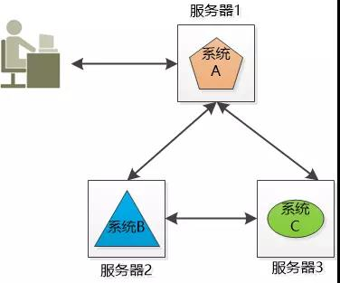
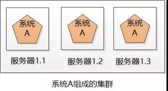
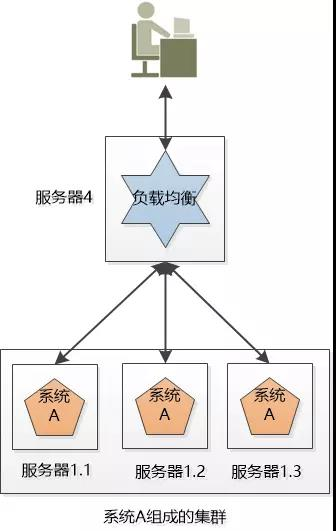
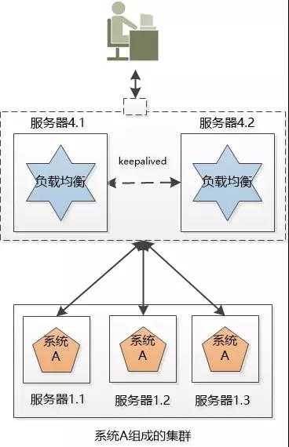
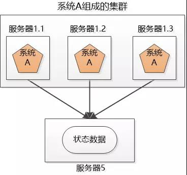

# 小白科普：分布式和集群

 | 来自：码农翻身（微信号：coderising）

## 1 分布式

小明的公司有3个系统： 系统 A、系统 B 和系统 C，这三个系统所做的业务不同，被部署在3个独立的机器上运行， 他们之间互相调用（当然是跨域网络的）， 通力合作完成公司的业务流程。

<!--more-->
将不同的业务分布在不同的地方， 这就构成了一个**分布式**的系统，现在问题来了， 系统A是整个分布式系统的“脸面”， 用户直接访问，用户量访问大的时候要么是速度巨慢，要么直接挂掉， 怎么办？

由于系统A只有一份， 所以会引起**单点失败**。

## 2 集群（Cluster）

小明的公司不差钱，就多买几台机器吧， 小明把系统A一下子部署了好几份（例如下图的3个服务器），**每一份都是系统A的一个实例， 对外提供同样的服务，**这样能睡个安稳觉了，不怕其中一个坏掉了，我还有另外两个呢。

这3个服务器上的系统就组成了一个集群。

可是对用户来说，一下子出现这么系统A ，每个系统的IP地址都不一样，  到底访问哪一个？

如果所有人都访问服务器1.1 ，那服务器1.1 会被累死， 剩下的三个闲死，成了浪费钱的摆设。

## 3 负载均衡（Load Balancer）

小明要尽可能的让3个机器上的系统A 工作均衡一些， 比如有3万个请求，那就让3个服务器各处理1万个（当然，这是理想状况）， 这叫**负载均衡**。

很明显，这个负载均衡的工作最好独立出来， 放到独立的服务器上 （例如Ngnix）：

后来小明发现， 这个**负载均衡**的服务器虽然工作内容很简单，就是拿到请求，分发请求，但是它还是有可能挂掉啊， **单点失败**还是会出现。

没办法，只好把**负载均衡**也搞成一个**集群**， 不过和系统A的集群有两点不同：

- 这个新的集群中虽然有两个机器，但我们可以用某种办法，让这个集群对外只提供一个IP地址， 也就是说**用户看到的好像只有一个机器**。
- **同一时刻，我们只让一个负载均衡的机器工作， 另外一个原地待命**。 如果工作的那个挂掉了，待命的那个就顶上去。

## 4 弹性

如果这3个系统A的实例还是满足不了大量的请求，那就再加服务器！

双11来了，用户量是平时的10倍， 小明向领导申请费用又买了几十台服务器，一下子把系统A部署了几十份。  可是双11过后， 流量一下子降下来了，那几十个服务器用不上了，也变成了摆设！

被领导批评以后，小明决定尝试一下云计算，  在云端可以轻松的创建、删除虚拟的服务器， 那样就可以轻松地随着用户的请求动态的增减服务器了。  双11来了就创建虚拟服务器，等到双11过去了就把不用的关掉， 省得浪费钱。

于是小明的系统具备了一定的弹性。

## 5 失效转移

上面的系统看起来很美好，但是做了一个不切实际的假设： 所有的服务都是无状态的。 换句话说，假设用户的两次请求直接是没有关联的。

但是现实是，大部分服务都是有状态的， 例如购物车。

用户访问系统，在服务器1.1上创建了一个购物车，并向其中加入了几个商品， 然后 服务器1.1 挂掉了， 用户的后续访问就找不到服务器1.1了，这时候就要做失效转移，让另外几个服务器去接管、去处理用户的请求。

可是问题来了，在服务器1.2，1.3上有用户的购物车吗？  如果没有， 用户就会抱怨，我刚创建的购物车哪里去了？

还有更严重的，假设用户是在服务器1.1上登录的， 用户登录过的信息保存到了该服务器的 session 中， 现在这个服务器挂掉了， 用户的 session 自然也不见了，当用户被失效转移到其他服务器上的时候，其他服务器发现用户没有登录， 就把用户踢到了登录界面， 让用户再次登录！

状态，状态，状态！用户的登录信息，购物车等都是状态信息，  处理不好状态的问题，集群的威力就大打折扣，无法完成真正的失效转移， 甚至无法使用。

怎么办？

一种办法是把状态信息在集群的各个服务器之间复制，让集群的各个服务器达成一致，  谁来干这个事情？ 只能是像 Websphere, Weblogic 这样的应用服务器了。

还有一种办法， 就是把状态信息集中存储在一个地方， 让集群的各个服务器都能访问到：

小明听说 Redis 不错， 那就用 Redis 来保存吧 ！
