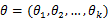
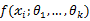
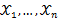
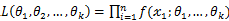

# 最大似然估计总结

最大似然估计方法（Maximum Likelihood Estimate，MLE）也称为极大概似估计或最大似然估计，是求估计的另一种方法，最大概似是1821年首先由德国数学家高斯（C. F. Gauss）提出，但是这个方法通常被归功于英国的统计学家罗纳德·费希尔（R. A. Fisher）。

## 作用

在已知试验结果（即是样本）的情况下，用来估计满足这些样本分布的参数，把可能性最大的那个参数 ***θ*** 作为真实 ***θ**** 的参数估计。说的通俗一点啊，最大似然估计，就是**利用已知的样本结果，反推最有可能（最大概率）导致这样结果的参数值(模型已知，参数未知）**。

<!--more-->

## 定义

* 离散型

设 χ 为离散型随机变量，为多维参数向量，如果随机变量  相互独立且概率计算式为P{  ，则可得概率函数为P{ }= ，在 固定时，上式表示 的概率；当 已知的时候，它又变成 的函数，可以把它记为 ，称此函数为似然函数。似然函数值的大小意味着该样本值出现的可能性的大小，既然已经得到了样本值 ，那么它出现的可能性应该是较大的，即似然函数的值也应该是比较大的，因而最大似然估计就是选择使 达到最大值的那个 *θ* 作为真实 *θ** 的估计。

* 连续型

设 χ 为连续型随机变量，其概率密度函数为，为从该总体中抽出的样本，同样的如果相互独立且同分布，于是样本的联合概率密度为。大致过程同离散型一样。

## 引题——概率密度函数（Probability Density Function）

这里，我们来考虑一个简单的情况(m=k=1)，即，参数和样本都为1的情况。假设进行一个实验，实验次数定为10次，每次实验成功率为0.2，那么不成功的概率为0.8，用y来表示成功的次数。由于前后的实验是相互独立的，所以可以计算得到成功的次数的概率密度为：

```math
=  其中 y 
```

由于y的取值范围已定，而且 ω 也为已知，所以图Ⅰ显示了 y 取不同值时的概率分布情况，而图Ⅱ显示了当 ω=0.7 时, y 的值概率情况。

|  图Ⅰ ω=0.2 时概率分布图 |  图Ⅱ ω=0.7 时概率分布图 |

那么 ω 在[0,1]之间变化而形成的概率密度函数的集合就形成了一个模型。

## 求解最大似然估计

根据上面的介绍，我们可以知道：对于图Ⅰ这种情况 y=2 是最有可能发生的事件。但是在现实中，我们还会面临另外一种情况：我们已经知道了一系列的观察值和一个感兴趣的模型，现在需要找出是哪个 PDF（具体来说参数 ω 为多少时）产生出来的这些观察值。要解决这个问题，就需要用到参数估计的方法，在最大似然估计法中，我们对调 PDF 中数据向量和参数向量的角色，于是可以得到似然函数的定义为：


该函数可以理解为，在给定了样本值的情况下，关于参数向量 ω 取值情况的函数。还是以上面的简单实验情况为例，若此时给定 y 为7，那么可以得到关于 ω 的似然函数为：


继续回顾前面所讲，图Ⅰ，Ⅱ是在给定 ω 的情况下，样本向量 y 取值概率的分布情况；而图Ⅲ是图Ⅰ,Ⅱ横纵坐标轴相交换而成，它所描述的似然函数图则指出在给定样本向量 y 的情况下，符合该取值样本分布的各种参数向量 ω 的可能性。若 $ω_1$ 相比于 $ω_2$ ，使得 y=7 出现的可能性要高，那么理所当然的 $ω_1$ 要比 ω_2 更加接近于真正的估计参数。所以求 ω 的极大似然估计就归结为求似然函数 *L* 的最大值点。那么 ω 取何值时似然函数 $L(ω|y=7)$ 最大，这就需要用到高等数学中求导的概念，如果是多维参数向量那么就是求偏导。

 图Ⅲ $L(ω|y=7)$ 的似然函数分布图

主要注意的是多数情况下，直接对变量进行求导反而会使得计算式子更加的复杂，此时可以借用对数函数。由于对数函数是单调增函数，所以 $logL(ω)=\sum_{i=1}^n log(x_i;ω_1,ω_2,...,ω_k)$ 与 $L(ω)$ 具有相同的最大值点，而在许多情况下，求 $L(ω)$ 的最大值点比较简单。于是，我们将求 $L(ω)$ 的最大值点改为求 $logL(ω)$ 的最大值点。


若该似然函数的导数存在，那么对 $logL(ω)$ 关于参数向量的各个参数求导数（当前情况向量维数为1），并命其等于零，得到方程组：


可以求得 $ω=0.7$ 时似然函数有极值，为了进一步判断该点位最大值而不是最小值，可以继续求二阶导来判断函数的凹凸性，如果 $ω=0.7$ 的二阶导为负数那么即是最大值，这里再不细说。
**还要指出，若函数 $f(x_1;θ_1,θ_2,...,θ_k)$ 关于 $θ_1,...,θ_k$ 的导数不存在，我们就无法得到似然方程组，这时就必须用其它的方法来求最大似然估计值，例如用有界函数的增减性去求 $L(θ)$ 的最大值点**。

## 最大似然估计小结

最大似然估计，只是一种概率论在统计学的应用，它是参数估计的方法之一。说的是已知某个随机样本满足某种概率分布，但是其中具体的参数不清楚，参数估计就是通过若干次试验，观察其结果，利用结果推出参数的大概值。最大似然估计是建立在这样的思想上：已知某个参数能使这个样本出现的概率最大，我们当然不会再去选择其他小概率的样本，所以干脆就把这个参数作为估计的真实值。

```text
求最大似然函数估计值的一般步骤：

  1. 写出似然函数；
  2. 对似然函数取对数，并整理
  3. 求导数
  4. 解似然方程
```

## 关于与最小二乘法的关系：

* 对于最小二乘法，当从模型总体随机抽取n组样本观测值后，最合理的参数估计量应该使得模型能最好地拟合样本数据，也就是**估计值和观测值之差的平方和最小**。最小二乘法从 Cost/Loss function 角度去想，一般建立模型就是让 loss function 最小，而最小二乘法可以认为是 loss function = $(y_hat -y)^2$ 的一个特例，类似的想各位说的还可以用各种距离度量来作为 loss function 而不仅仅是欧氏距离。所以 loss function 可以说是一种更一般化的说法。

* 对于最大似然法，当从模型总体随机抽取n组样本观测值后，最合理的参数估计量应该**使得从模型中抽取该n组样本观测值的概率最大**。最大似然估计是从概率角度来想这个问题，直观理解，似然函数在给定参数的条件下就是观测到一组数据 realization 的概率（或者概率密度）。最大似然函数的思想就是什么样的参数才能使我们观测到目前这组数据的概率是最大的。类似的从概率角度想的估计量还有矩估计（moment estimation）。就是通过一阶矩 二阶矩等列方程，来反解出参数。显然，这是从不同原理出发的两种参数估计方法。

* 最大似然估计和最小二乘法还有一大区别就是，最大似然估计是需要有分布假设的，属于参数统计，如果连分布函数都不知道，又怎么能列出似然函数呢？ 而最小二乘法则没有这个假设。 二者的相同之处是都把估计问题变成了最优化问题。但是最小二乘法是一个凸优化问题，最大似然估计不一定是。在最大似然法中，通过选择参数，使已知数据在某种意义下最有可能出现，而某种意义通常指似然函数最大，而似然函数又往往指数据的概率分布函数。与最小二乘法不同的是，最大似然法需要已知这个概率分布函数，这在时间中是很困难的。**一般假设其满足正态分布函数的特性，在这种情况下，最大似然估计和最小二乘估计相同**。

首先，假设线性回归模型具有如下形式：

$$f(x) = \sum_{j=1}^n x_j ω_j + ε = X W^T + ε$$

其中，$X \in R^{1 \times d}, W \in R^{1 \times d}$, 误差$ε \in R$。

当前已知$X=(x_1,x_2,...,x_n)^T \in R^{n  times d},y \in R^{n times 1}$,怎么求 W 呢？

策略1：假设 $ε_i~N(0,σ^2)$,也就是说 $y_i ~ N(X_i W^T,σ^2)$，那么用最大似然估计推导：

$$ \arg{ \max_w L(W)=\ln{ \sum_{i=1}^n \frac{1}{\sqrt{2π}}exp(- \frac{1}{2}( \frac{y_i - X_i W^T}{σ}))}} $$

$$=-\frac{1}{2 σ^2} \sum_{i=1}^n (y_i-X_iW^T)^2 -n ln σ \sqrt{2π}$$

$$ \arg{ \min_W f(W)=\sum_{i=1}^n(y_i - X_i W^T)^2 = ||y - XW^T||_{2}^2} $$

这不就是最小二乘么。

总而言之，最小二乘法以估计值与观测值的差的平方和作为损失函数，极大似然法则是以最大化目标值的似然概率函数为目标函数，从概率统计的角度处理线性回归并在似然概率函数为高斯函数的假设下同最小二乘建立了的联系。
